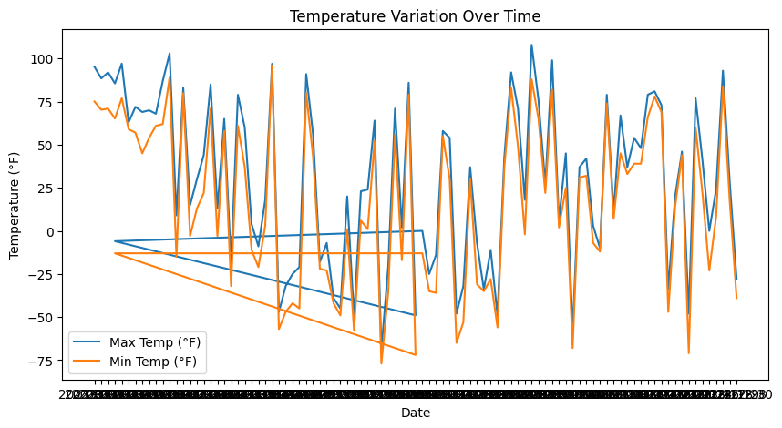
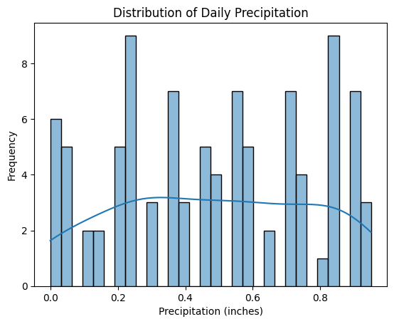
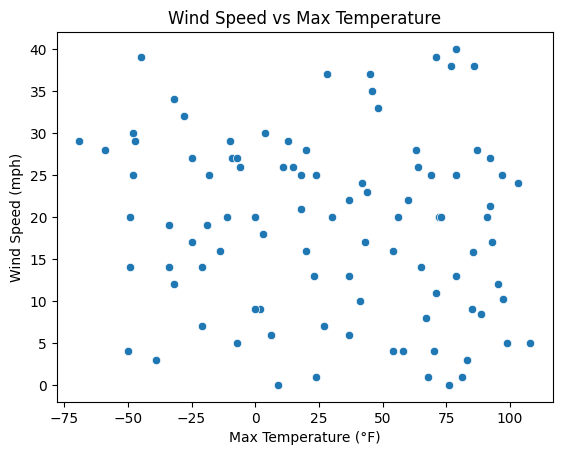
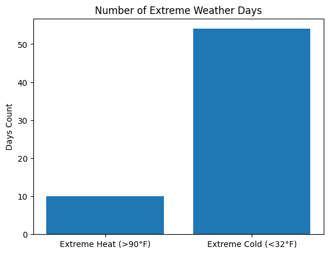

# Weather Data Analysis

## 1. Introduction
This project provides a comprehensive analysis of the weather pattern collected from a particular weather station. 

## 2.Data Source
The data for this project was obtained from the [linkedin](https://www.linkedin.com/feed/update/urn:li:activity:7371233708634419200/) post of [Mary Knoeferl](https://www.linkedin.com/in/mary-knoeferl/). 

## 3.Data Cleaning and Transformation
The raw data underwent several crucial cleaning and transformation steps to ensure accuracy, consistency, and suitability for analysis. This included:

**Handling outliers:** An additional column has been added by the name of *is_extremeWeather* to identify outliers having extreme temperature differences of >25.

**Handling Negative Values:** Rows where precipitation denoted by *precipitation_in* is *negative* has been corrected. Rows where wind speed denoted by *wspd_mph* is *negative* has been corrected.

**Swapping values:** To enable proper analysis, values of maximum and minimum temperature denoted by *tmax_f* and *tmin_f* has been swapped wherever values were placed incorrectly.

## 4. Visualization and Insights

**Temperature Variation Over Time**

**Distribution of Daily Precipitation**

**Temperature Vs Wind Speed**

**Extreme Heat Vs Cold Days**

